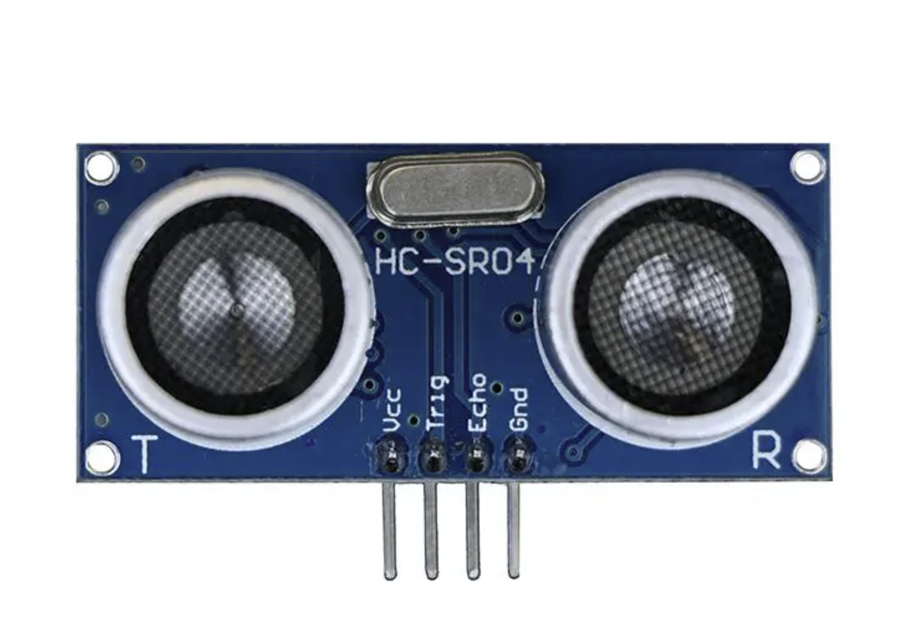
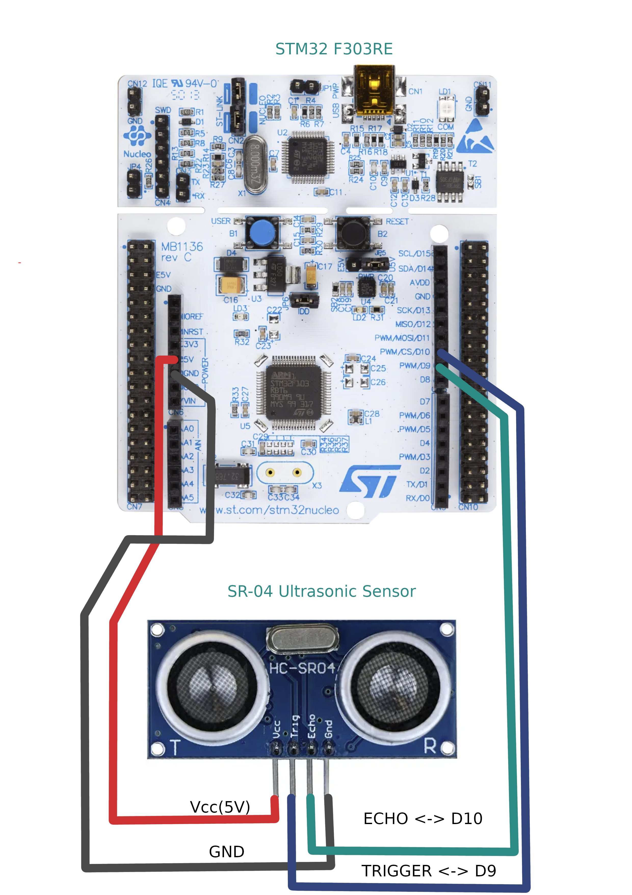

# mbed-ultrasonic
An MBED library to interface with Arduino Ultrasonic Shield Mbed OS 6 Compatible.

Ultrasonic Sensor - HC-SR04
========================================

[](https://www.sparkfun.com/products/15569)

[*Ultrasonic Sensor HC-SR04 (SEN-15569)*](https://www.sparkfun.com/products/15569)

This is the HC-SR04 ultrasonic ranging sensor. This economical sensor provides 2cm to 400cm of non-contact measurement functionality with a ranging accuracy that can reach up to 3mm. 

There are only four pins that you need to worry about on the HC-SR04: VCC (Power), Trig (Trigger), Echo (Receive), and GND (Ground). 

[*HC-SR04 data sheet*](https://cdn.sparkfun.com/datasheets/Sensors/Proximity/HCSR04.pdf)


Repository Contents
-------------------

* **Firmware** - An Mbed example code compatible with STM32 NUCLEO Boards as a bare minimum.. Make sure to check the pin definitions and what you are connecting to.

```c++

#include "mbed.h"
#include "Ultrasonic_SR04.h"

int main()
{
    DigitalOut led(LED1);
    Ultrasonic_SR04 ultrasonicSR04(D10, D9, 22);
    while(true)
    {
        led=0;
        float_t distance = ultrasonicSR04.MeasureDistance();
        // Mbed OS 6.15's printf() is broken and incapable of printing float or double. so we had to invent a way to do thigs.
        printf("\nDistance:  %llu.%llu m\n", (uint64_t)distance, (((uint64_t)(distance*1000))%1000));
        ThisThread::sleep_for(500ms);
        led=1;
    }
}
```
Pin Connections
---------------


Documentation
--------------

<div class="header">

<div class="summary">

[Public Member Functions](#pub-methods)

</div>

<div class="headertitle">

<div class="title">

Ultrasonic_SR04 Class Reference

</div>

</div>

</div>

<div class="contents">

Creates an instance to access Ultrasonics Hardware and measure the
distance to traget using sound waves for a given temperature.

`#include <Ultrasonic_SR04.h>`

<table class="memberdecls">
<colgroup>
<col style="width: 50%" />
<col style="width: 50%" />
</colgroup>
<tbody>
<tr class="odd heading">
<td colspan="2"><h2 id="public-member-functions"
class="groupheader"><span id="pub-methods"></span> Public Member
Functions</h2></td>
</tr>
<tr class="even memitem:a6374a4209512c6cbddd0aa014e01e287">
<td class="memItemLeft" style="text-align: right;"
data-valign="top"> </td>
<td class="memItemRight" data-valign="bottom"><a
href="Ultrasonic_SR04/Ultrasonic_SR04.h#L65"
class="el">Ultrasonic_SR04</a> (PinName triggerPin, PinName echoPin,
float_t temperature=ROOM_TEMPERATURE_IN_CELCIUS, uint64_t
maxTimeoutMicroSec=MAX_TIMEOUT_IN_US)</td>
</tr>
<tr class="odd memdesc:a6374a4209512c6cbddd0aa014e01e287">
<td class="mdescLeft"> </td>
<td class="mdescRight">Construct a new Ultrasonic SR04 object.
<br />
</td>
</tr>
<tr class="even separator:a6374a4209512c6cbddd0aa014e01e287">
<td colspan="2" class="memSeparator"> </td>
</tr>
<tr class="odd memitem:a609f0762abbdeffdc8905481bd4c6765">
<td class="memItemLeft" style="text-align: right;"
data-valign="top">void </td>
<td class="memItemRight" data-valign="bottom"><a
href="Ultrasonic_SR04/Ultrasonic_SR04.h#L72"
class="el">UpdateForTemperature</a> (float_t temperature)</td>
</tr>
<tr class="even memdesc:a609f0762abbdeffdc8905481bd4c6765">
<td class="mdescLeft"> </td>
<td class="mdescRight">Update the temperature and corresponding
dependent variables.<br />
</td>
</tr>
<tr class="odd separator:a609f0762abbdeffdc8905481bd4c6765">
<td colspan="2" class="memSeparator"> </td>
</tr>
<tr class="even memitem:ae2e4633a124d74677b715a3ec5af5647">
<td class="memItemLeft" style="text-align: right;"
data-valign="top">float_t </td>
<td class="memItemRight" data-valign="bottom"><a
href="Ultrasonic_SR04/Ultrasonic_SR04.h#L83"
class="el">MeasureDistance</a> (float_t temperature)</td>
</tr>
<tr class="odd memdesc:ae2e4633a124d74677b715a3ec5af5647">
<td class="mdescLeft"> </td>
<td class="mdescRight">Measure the distance from the utlrasonic sensor
and returns the distance while Updating the temperature parameter.
<br />
</td>
</tr>
<tr class="even separator:ae2e4633a124d74677b715a3ec5af5647">
<td colspan="2" class="memSeparator"> </td>
</tr>
<tr class="odd memitem:a24f828b8add77ae35093044a984ab9f1">
<td class="memItemLeft" style="text-align: right;"
data-valign="top">float_t </td>
<td class="memItemRight" data-valign="bottom"><a
href="Ultrasonic_SR04/Ultrasonic_SR04.h#L90"
class="el">MeasureDistance</a> ()</td>
</tr>
<tr class="even memdesc:a24f828b8add77ae35093044a984ab9f1">
<td class="mdescLeft"> </td>
<td class="mdescRight">Measure the distance from the utlrasonic sensor
and returns the distance. <br />
</td>
</tr>
<tr class="odd separator:a24f828b8add77ae35093044a984ab9f1">
<td colspan="2" class="memSeparator"> </td>
</tr>
</tbody>
</table>

<span id="details"></span>

## Detailed Description

<div class="textblock">

Creates an instance to access Ultrasonics Hardware and measure the
distance to traget using sound waves for a given temperature.

</div>


Product Versions
----------------
* [SEN-15569](https://www.sparkfun.com/products/15569)- Blue ultrasonic sensor w/ crystal
* [SEN-13959](https://www.sparkfun.com/products/13959)- Red ultrasonic sensor w/out crystal

License Information
-------------------
Please review the LICENSE.md file for license information. 

If you have any questions or concerns on licensing, please contact amouroug@buffalo.edu.

Distributed as-is; no warranty is given.